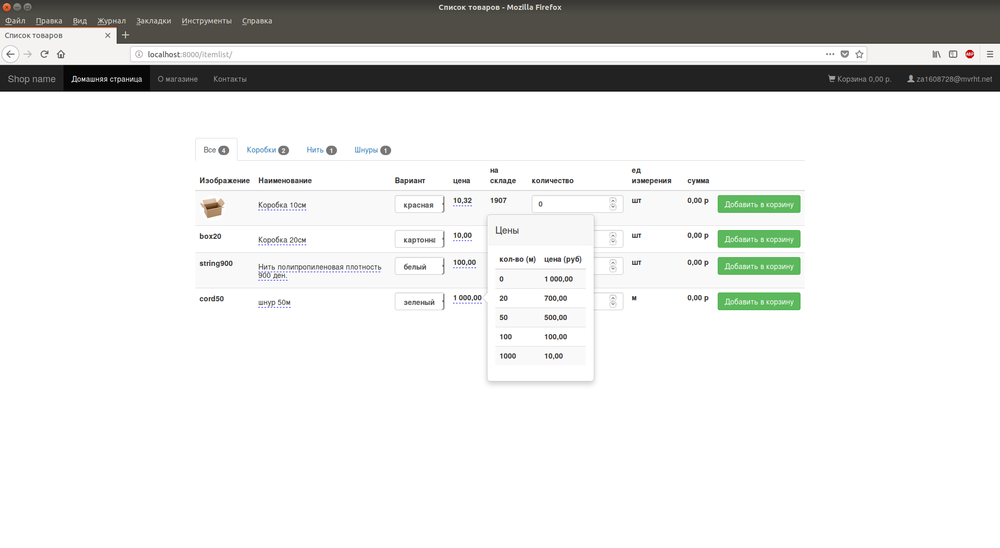
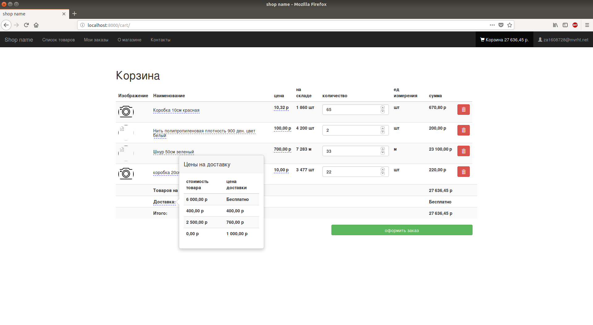
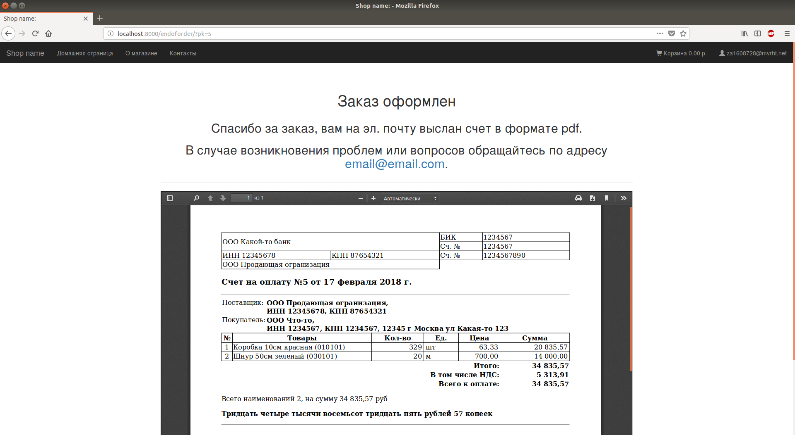
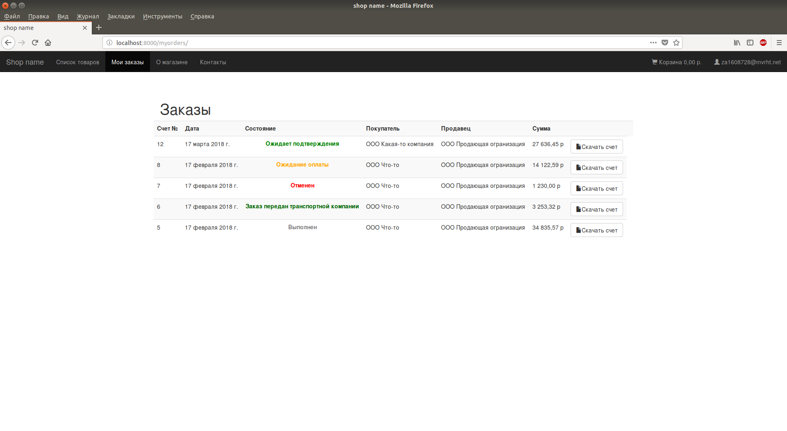

# B2B_MarketPlace platform
Internet shop for b2b wholesale trade. Written in Python3 using Django framework and many other libraries.

## Features
* Prices depend on quantity.
* After making an order you will immediately get an invoice in pdf format.
* You have a list of your previous orders with custom statuses.
* You can update quantities by uploading xls file from 1C.

## Problems
* Views should be classes, not functions.
* Taxes are hardcoded. I will add special models for taxes calculation later (formulas like "$TOTALSUM * 0.18 + $DELIVERY * 0.06").
* Project needs more tests.
* Maybe I should use [django-bootstrap](https://github.com/dyve/django-bootstrap3) and [django REST framework](http://www.django-rest-framework.org/). 

## Built With
* [Python3](https://www.python.org/)
* [Django](https://www.djangoproject.com/)
* [django-user-accounts](https://github.com/pinax/django-user-accounts)
* [Pinax Bootstrap Theme](https://github.com/pinax/pinax-theme-bootstrap)
* [wkhtmltopdf](https://wkhtmltopdf.org)
* [pdfkit](https://pypi.python.org/pypi/pdfkit)
* [num2words](https://pypi.python.org/pypi/num2words/)
* [Suggestions by DaData.ru](https://dadata.ru/suggestions/)
* [xlrd](https://github.com/python-excel/xlrd)

## Screenshots

